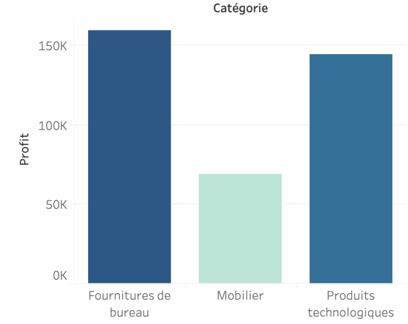
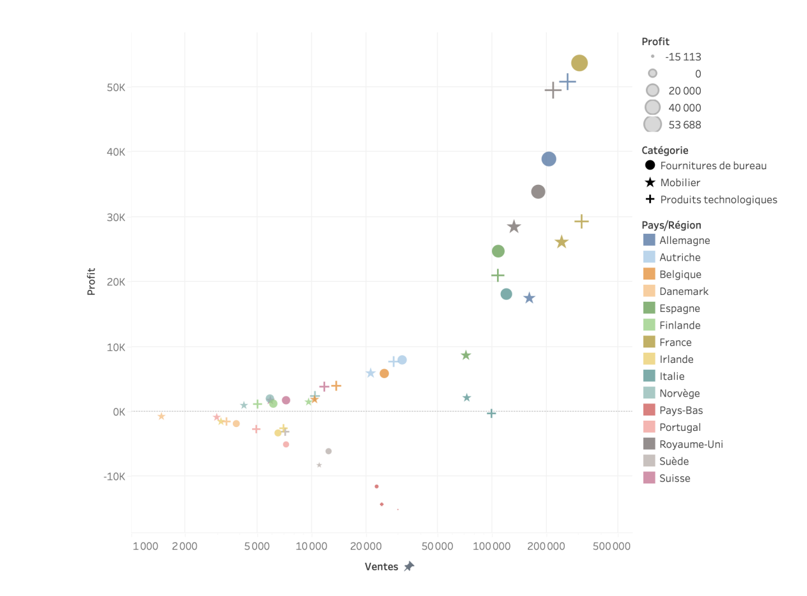
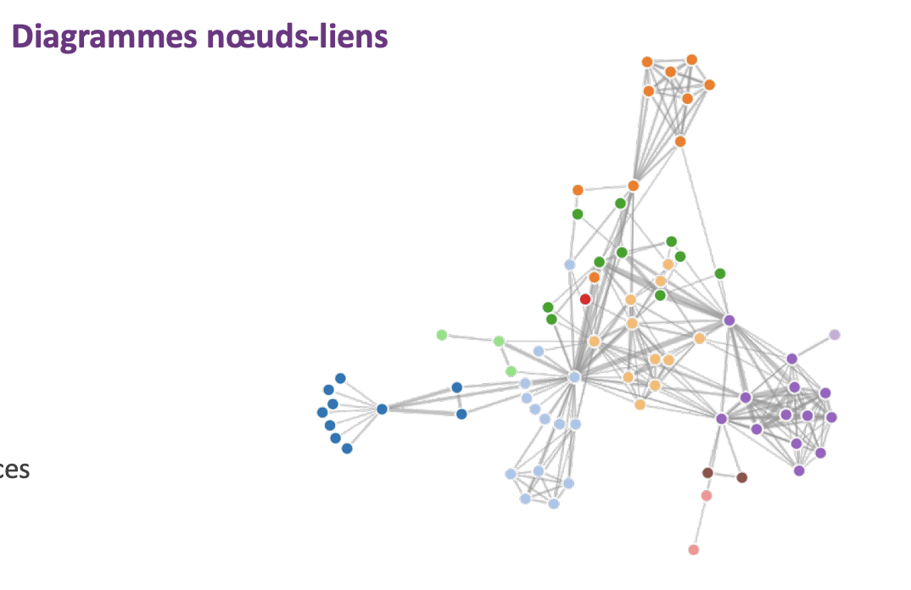
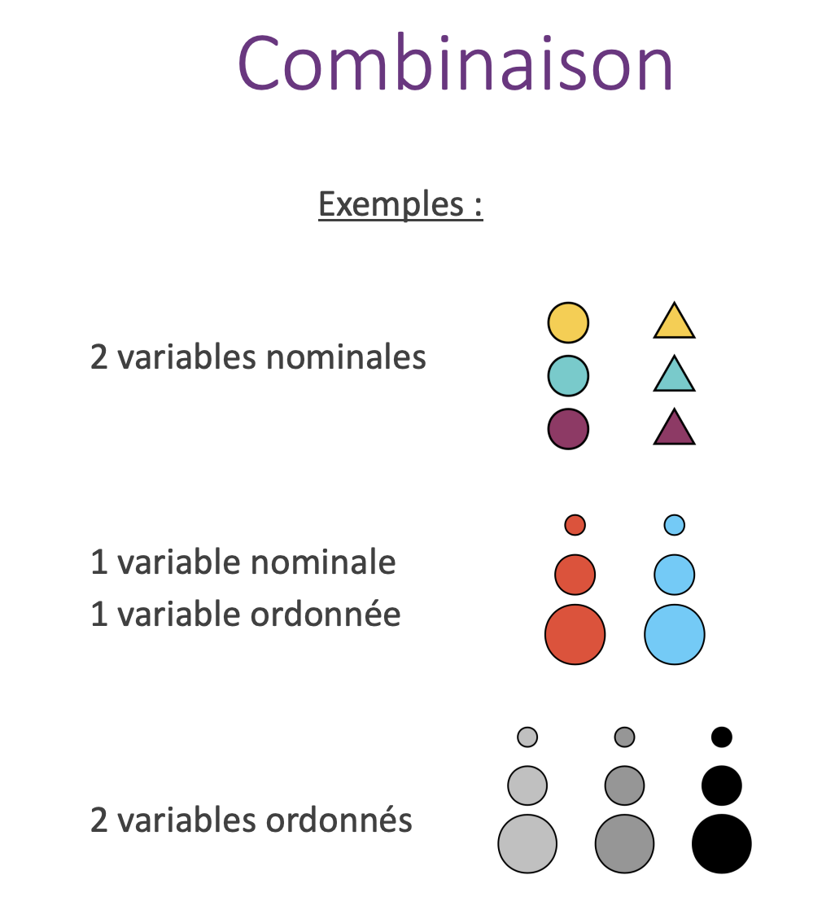

## Révisions pour le controle de datavis

### Types de variables

- Nominales: Variable avec un nom, qu'on peut diviser en catégorie ou type (ex: couleur, genre, etc.)

- Ordinale: Nominale mais avec un ordre, par exemple les tailles pour les vetements (S, M, L, XL)

- Quantitative: Variable numérique, l'age par exemple. 


### Les types de graphiques

#### Histogramme


Pour les données **quantitatives**

On séparre les données en intervalles et on compte le nombre de données dans chaque intervalle.

#### Diagramme en barres



Semblable à l'histogramme, mais pour les données **nominales** ou **ordinale**.

#### Diagramme circulaire

> :warning: Difficiile à lire, à éviter

#### Graphique



Permet de visualiser les relations entre les données, par exemple les relations entre les variables.

On peut aussi exprimer une évolution temporale.


#### Réseaux



Permet de visualiser les relations entre les données, par exemple les relations entre les variables.

On peut aussi combiner ca avec une map pour voir des relations géographiques. Comme par exemple des mouvements de population.

#### Cartes

On peut aussi utiliser des cartes pour visualiser des données géographiques. et rajouter des points dessus ou tout autre type de forme / couleur / taille pour représenter nos variables.

#### Les palette de couleurs

Il faut adapter le choix de la palette de couleur en fonction de la variable qu'on veut représenter (bon sens en vrai)




## D3.js

D3 = lib pour faire des graphiques en javascript


### Les élements de base

#### Faire des groupes

```javascript
// On créer un svg de 500x500
let svg = d3.select("body").append("svg")
    .attr("width", 500)
    .attr("height", 500);
// Ici on rajoute un groupe dans le svg
let gGlobal = svg.append("g");

// On pourra ensuite rajouter des elements dans ce groupe
let gxAxis = gGlobal.append("g");
```

#### Les échelles

```javascript
// On créer une échelle linéaire
let scaleY = d3.scaleLinear();
// On lui donne un domaine
scaleY.domain([0, 100]);
// On lui donne une range
scaleY.range([0, 500]);

// On peut ensuite utiliser cette échelle pour calculer des valeurs

console.log(scaleY(50)); // 250
```

Ici le domaine exprime les valeurs de base de nos données (de ou à ou elles vont), et la range exprime la taille de notre graphique (de ou à ou il va).

On peut faire des echelles autre que linéaire, par exemple pour des données discrètes on peut utiliser `scaleBand`

```javascript
	let scaleX = d3.scaleBand();
    scaleX.domain(["A", "B", "C", "D"]);
    scaleX.range([0, 500]);

    console.log(scaleX("A")); // 0
    console.log(scaleX("B")); // 125
    console.log(scaleX("C")); // 250
    console.log(scaleX("D")); // 375
```

#### Les axes

Une fois qu'on a nos échelles on peut créer des axes, ils vont nous permettre de rajouter des graduations sur notre graphique.

```javascript

// On créer un axe horizontal en bas
let xAxis = d3.axisBottom(scaleX);
// On créer un axe vertical à gauche
let yAxis = d3.axisLeft(scaleY);

// On va faire un groupe pour notre axe
let gxAxis = gGlobal.append("g");
// On lui donne l'axe
gxAxis.call(xAxis);
// On le déplace
gxAxis.attr("transform", "translate(30,460)");

// On va faire un groupe pour notre axe
let gyAxis = gGlobal.append("g");
// On lui donne l'axe
gyAxis.call(yAxis);
// On le déplace
gyAxis.attr("transform", "translate(30,10)");
```

#### Les attributs

On peut rajouter des attributs à nos éléments, par exemple pour un rectangle

```javascript
    let barre = gBarres.append("rect")
        .attr("width", scaleX.bandwidth() - 2)
        .attr("height", 450 - scaleY(barLengths[key]))
        .attr("x", 1 + scaleX(key))
        .attr("y", scaleY(barLengths[key]))
        .attr("fill", "red");
```

Cela va nous permettre de créer de manière brut nos graphiques, on peut ensuite les modifier avec des transitions, des animations, etc.

#### Les palette de couleurs

On peut utiliser des palettes de couleurs pour nos graphiques, par exemple pour un line chart

```javascript
var colorScale = d3.scaleOrdinal(d3.schemeCategory10);
for (var j = 0; j < data.length; j++) {
    gLignes.append("path")
        .attr("d", lValues(data[j]["valeurs"]))
        .attr("stroke", "teal")
        .attr("fill", "none")
        .attr("stroke", colorScale(j));
}
```

#### Rajouter des controles (Zoom)

On peut rajouter des controles à nos graphiques, par exemple un zoom

```javascript

// On créer un zoom
var z = d3.zoom();
// On lui donne une fonction pour le zoom
z.on("zoom", function ({ transform }) {
    gGlobal.attr("transform", transform);
});
// On l'ajoute à notre svg
svg.call(z);
```


### Exemple simple avec un bar chart

```html
<!DOCTYPE html>
<html lang="fr">

<head>
	<meta charset="UTF-8" />
	<title>Diagramme en barres D3</title>
</head>

<body>
	<svg id="vis" width="500" height="500" style="border: 1px solid gray"></svg>
</body>

</html>
<script type="module">
	import * as d3 from "https://cdn.jsdelivr.net/npm/d3@7/+esm";

    // Ici on importe notre json dans l'objet data
	const data = await d3.json("exo1G.json")

	let barLengths = {};

	for (let i = 0; i < data.length; i++) {
		if (barLengths[data[i]] == undefined) {
			barLengths[data[i]] = 1;
		}
		else {
			barLengths[data[i]] = barLengths[data[i]] + 1;
		}
	}

	console.log("barlength", barLengths)

	// Methode pour calculer la range max des données afin qu'elle s'adapte en Y 
	function maxData(d) {
		let m = 0;
		for (let key in d) {
			if (d[key] > m) {
				m = d[key]
			}
		}
		return m;
	}

	// Fonction pour calculer la range en X puisque les valeurs sont discretes (A, B, C ...)
	function tabOfKeys(d) {
		let t = [];
		let i = 0;
		for (let key in d) {
			t[i] = key;
			i++;
		}
		return t;
	}

	// Lineaire parce que les valeurs sont des entiers
	let scaleY = d3.scaleLinear();
	scaleY.domain([0, maxData(barLengths)]);
	scaleY.range([450, 0]);

	// Band car les valeurs sont des lettres (chaque barre du diagramme)
	let scaleX = d3.scaleBand();
	scaleX.domain(tabOfKeys(barLengths));
	scaleX.range([0, 450]);


	// On créer ensuite les axes
	let xAxis = d3.axisBottom(scaleX);
	let yAxis = d3.axisLeft(scaleY);

	// On link le svg du HTML avec notre d3
	let svg = d3.select("#vis");

	// On créer un g global qui va contenir les autres afin de rajouter un zoom
	let gGlobal = svg.append("g");

	// On rajoute le zoom
	var z = d3.zoom();
	z.on("zoom", function ({ transform }) {
		gGlobal.attr("transform", transform);
	});
	svg.call(z);


	// On va ensuite eux balises g dans le svg pour les 2 axes afins qu'ils puissent se scale 
	let gxAxis = gGlobal.append("g");
	gxAxis.call(xAxis);
	gxAxis.attr("transform", "translate(30,460)");
	let gyAxis = gGlobal.append("g");
	gyAxis.call(yAxis);
	gyAxis.attr("transform", "translate(30,10)");

	// On va rajouter un nouveau groupe pour les barres dans notre svg
	let gBarres = gGlobal.append("g");
	gBarres.attr("transform", "translate(30,10)");

	// On vient rajouter un rectangle de test 50x50 en x: 70 y: 90 de couleur orange
	// let barre = gBarres.append("rect"); // Ajout d’un objet SVG rect à gBarres
	// barre.attr("width", 50); // Largeur de l’objet
	// barre.attr("height", 50); // Hauteur de l’objet
	// barre.attr("x", 70); // Position x de l’objet
	// barre.attr("y", 90); // Position y de l’objet
	// barre.attr("fill", "orange"); // Couleur de l’objet

	// On vient boucler sur les valeurs des barres afin de les rajouter dans le schema
	for (let key in barLengths) {
		let barre = gBarres.append("rect")
			.attr("width", scaleX.bandwidth() - 2)
			.attr("height", 450 - scaleY(barLengths[key]))
			.attr("x", 1 + scaleX(key))
			.attr("y", scaleY(barLengths[key]))
			.attr("fill", "red");
	}

</script>
```

### Exemple simple avec un line chart

```html
<!DOCTYPE html>
<html lang="fr">

<head>
	<meta charset="UTF-8" />
	<title>Diagramme en lignes D3</title>

	<script type="module">
		import * as d3 from "https://cdn.jsdelivr.net/npm/d3@7/+esm";

		function maxData(d) {
			var m = 0;
			for (var i = 0; i < d.length; i++) {
				for (var j = 0; j < d[i]["valeurs"].length; j++) {
					if (d[i]["valeurs"][j] > m) {
						m = d[i]["valeurs"][j];
					}
				}
			}
			return m;
		}

		function nbValParLigne(d) {
			return d[0]["valeurs"].length;
		}

		d3.json("exo3.json").then(function (data) {

			// Echelle X
			var scaleX = d3.scaleLinear();
			scaleX.domain([1, nbValParLigne(data)]);
			scaleX.range([0, 450]);

			// Echelle Y
			var scaleY = d3.scaleLinear();
			scaleY.domain([0, maxData(data)]);
			scaleY.range([450, 0]);

			// Création des axes X et Y
			var xAxis = d3.axisBottom(scaleX);
			var yAxis = d3.axisLeft(scaleY);

			// Récupération du SVG
			var svg = d3.select("#vis");

			// Ajout de l'axes X au SVG
			var gxAxis = svg.append("g");
			gxAxis.call(xAxis);
			gxAxis.attr("transform", "translate(30,460)");

			// Ajout de l'axes Y au SVG
			var gyAxis = svg.append("g");
			gyAxis.call(yAxis);
			gyAxis.attr("transform", "translate(30,10)");

			// Lignes
			var gLignes = svg.append("g");
			gLignes.attr("transform", "translate(30,10)");

			var lValues = d3.line();
			lValues.x(function (d, i) {
				return (450 / (nbValParLigne(data) - 1)) * i;
			});
			lValues.y(function (d, i) {
				return 450 - scaleY(d);
			});
			var colorScale = d3.scaleOrdinal(d3.schemeCategory10);
			for (var j = 0; j < data.length; j++) {
				gLignes.append("path")
					.attr("d", lValues(data[j]["valeurs"]))
					.attr("stroke", "teal")
					.attr("fill", "none")
					.attr("stroke", colorScale(j));
			}

		});

	</script>
</head>

<body>
	<svg id="vis" width="500" height="500"></svg>
</body>

</html>
```