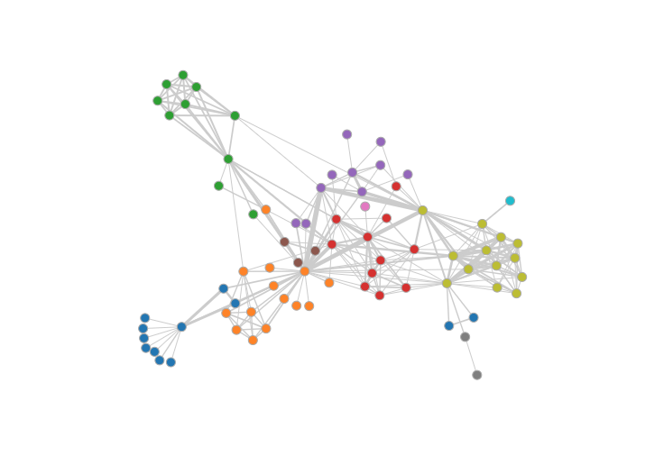

### Exo 1

> Reprenez l’exemple de la partie 1 et définissez  les  tâches  que  les  individus  du  public ciblé  devront  pouvoir  accomplir  avec  votre  visualisation,  les  structures  de  données  que  vous  allez utiliser et les attributs dérivés que vous allez calculer. 

Avec notre outils les utilisateurs vont pouvoir déterminer quels utilisateurs de la plateforme sont les plus influents par groupe. Il est important de trouver des utilisateurs influents dans des groups differents.

En terme de visualisation on pourrait utiliser des graphes en reseau avec des noeuds qui representent chacun des utilisateurs. De cette manière on aurait pourrait voir facilement si un utilisateur a des liens avec beaucoup de monde dans plusieurs groupes.

Pour les valeurs dérivés on peut prendre en compte le nombre d'interaction d'un individu et la taille du groupe duquel il fait parti 

### Exo 2
> Reprenez l’exemple précédent et proposez une visualisation.

Voici à quoi porrait ressembler notre graphe, des noeuds pour chacun user avec des couleurs pour leur apartenance à des groupes et la taille de l'arrête par rapport au nombre d'échange.

On utiliserait une palette qualitative

### Exo 3

